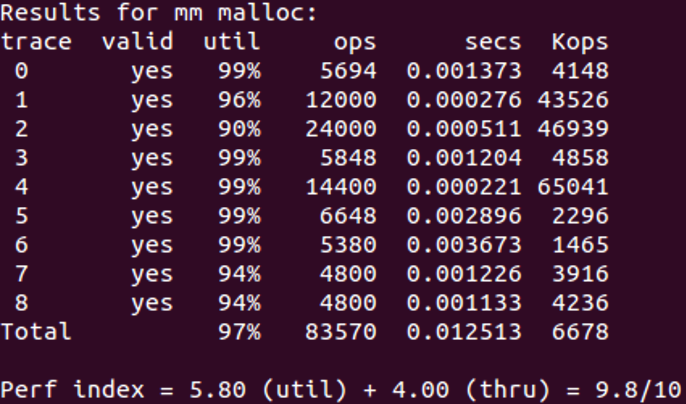

# 3-PB17111568-郭雨轩

## 主要步骤

在这个malloc的实验中，我阅读了csapp一书的第九章，为了保证每次匹配都达到局部最优的状态，我使用了分离链表的实现。在将在不同大小区间的块分别串到不同的链表中去，在每个链表中，按照块大小进行排序插入。当进行查找的时候，使用首次适配的方法，在这种情况下，首次查找得到的块即为当前情况下的最优解。

## 核心代码解析

1. `mm_init()`

   ``` c
   int mm_init(void)
   {
       first_malloc=1;
       first_extend=1;
       char *bp;
       if ((heap_listp = mem_sbrk(16 * WSIZE)) == (void *) -1)
           return -1;
   
       int i;
       for (i=0; i<NUMBERS; ++i)
       {
           start_p[i]=heap_listp+((i+1)*WSIZE);
       }
       PUT(heap_listp, 0);// first block
       PUT(heap_listp + (1*WSIZE), NULL);//1
       PUT(heap_listp + (2*WSIZE), NULL );//2
       PUT(heap_listp + (3*WSIZE), NULL );//3
       PUT(heap_listp + (4*WSIZE), NULL );//4
       PUT(heap_listp + (5*WSIZE), NULL );//5
       PUT(heap_listp + (6*WSIZE), NULL );//6
       PUT(heap_listp + (7*WSIZE), NULL );//7  
       PUT(heap_listp + (8*WSIZE), NULL );//8 
       PUT(heap_listp + (9*WSIZE), NULL );//9 
       PUT(heap_listp + (10*WSIZE), NULL );//10 
       PUT(heap_listp + (11*WSIZE), NULL );//11 
       PUT(heap_listp + (12*WSIZE), NULL );//12 
       PUT(heap_listp + (13*WSIZE), NULL );//13 
       PUT(heap_listp + (14*WSIZE), PACK(WSIZE, PN_U));
       PUT(heap_listp + (15*WSIZE), PACK(0, PU_U));     //lenth 0, previous not used
   
       heap_listp += (14*WSIZE);//heap start addr
       if ((bp = extend_heap(2*(CHUNKSIZE+8)/WSIZE)) == NULL)
           return -1;
       return 0;
   }// Done!
   
   ```

   这个函数可以看到，我在开头的分配了一大堆空间用来储存每一级链表的头，总共大小的等级被分为13级，每一级对应的区间在代码宏定义中。

2. `coalesce()`

   ``` c
   static void *coalesce(void *bp)
   {
       // 合并的坑，因为这些空闲块在逻辑上面相邻，但是在地址上面不一定相邻，所以在合并的时候要分开讨论
       //从当前块头读出前一个块是否分配
       size_t is_prev_alloc = GET_PREV_INFO(HDRP(bp));
       //通过块大小计算出后一块，看它是否分配
       size_t is_succ_alloc = GET_ALLOC(HDRP(NEXT_BLKP(bp)));
       //读出当前块的大小
       size_t size = GET_SIZE(HDRP(bp));
   
   
       if (is_prev_alloc==2 && is_succ_alloc==1)
       {
           PUT_PREV(bp,NULL);
           PUT_SUCC(bp,NULL);
           PUT(HDRP(bp),PACK(size,PU_N));
           PUT(FTRP(bp),PACK(size,PU_N));
           //更改这个块之后的块的状态，按位与一个掩码，将其次低位置为0，标记为前块未用
           PUT(HDRP(NEXT_BLKP(bp)), (GET(HDRP(NEXT_BLKP(bp))) & MASK_PN));
       }
       else if (is_prev_alloc==2 && is_succ_alloc==0)
       {
           //前驱被分配，后继未被分配(物理地址)
           //先不更新size，用未增加的size找到当前块的后继的后继，将链表维护完整
           char *t2=(char *)NEXT_BLKP(bp); //get物理位置之后的那个节点
           PUT_SUCC(GET_PREV(t2),GET_SUCC(t2));//t2逻辑前驱节点的后继 <==
           
           if (GET_SUCC(t2))//若t2节点的逻辑后继存在
           {
               PUT_PREV(GET_SUCC(t2),GET_PREV(t2));
           }//至此，将t2节点从双向链表中独立出来了
           
           //再更新size
           size += GET_SIZE(HDRP(NEXT_BLKP(bp)));
           //先将头信息更新，再用头的信息去找脚
           PUT(HDRP(bp), PACK(size, PU_N));
           PUT(FTRP(bp), PACK(size, PU_N));
           //至此，完成了将bp和t2合为一体（物理）
   
           //再将这个节点的前驱和后继分别置为NULL，等待插入
           PUT_PREV(bp,NULL);
           PUT_SUCC(bp,NULL);
           //更改这个块之后的块的状态（物理相邻），按位与一个掩码，将其次低位置为0，标记为前块未用
           PUT(HDRP(NEXT_BLKP(bp)), (GET(HDRP(NEXT_BLKP(bp))) & MASK_PN));        
           
       }
       else if (is_prev_alloc==0 && is_succ_alloc==1)
       {
           //前驱未被分配，后继被分配
           //先不更新size，用未增加的size找到当前块的后继的后继，将链表维护完整
           char *t1=(char *)PREV_BLKP(bp);//另t1为bp物理地址上靠前的节点
           PUT_SUCC(GET_PREV(t1),GET_SUCC(t1));//前面节点的前驱 的后继更改为自己的后继
           if (GET_SUCC(t1))
           {
               PUT_PREV(GET_SUCC(t1),GET_PREV(t1));
           }
           //再更新size
           size += GET_SIZE(HDRP(PREV_BLKP(bp)));
           bp = PREV_BLKP(bp);
           //先将头信息更新，再用头的信息去找脚
           //注意，前驱的前驱一定被占用
           PUT(HDRP(bp), PACK(size, PU_N));
           PUT(FTRP(bp), PACK(size, PU_N));
           //最后分别将指针置为0，等待插入
           PUT_PREV(bp,NULL);
           PUT_SUCC(bp,NULL);
           //printf("3");
           //更改这个块之后的块的状态，按位与一个掩码，将其次低位置为0，标记为前块未用
           PUT(HDRP(NEXT_BLKP(bp)), (GET(HDRP(NEXT_BLKP(bp))) & MASK_PN));   
           
       }
       else 
       {
           //前驱未被占用，后继被占用
           //先不更新size，用未增加的size找到当前块的后继的后继，将链表维护完整
           char *t1=(char *)PREV_BLKP(bp);//另t1为bp物理地址上靠前的节点
           char *t2=(char *)NEXT_BLKP(bp); //get物理位置之后的那个节点
           PUT_SUCC(GET_PREV(t1),GET_SUCC(t1));//前面节点的前驱 的后继更改为bp的后继
           if (GET_SUCC(t1))
           {
               PUT_PREV(GET_SUCC(t1),GET_PREV(t1));
           }
   
           PUT_SUCC(GET_PREV(t2),GET_SUCC(t2));//t2逻辑前驱节点的后继 
           if (GET_SUCC(t2))//若t2节点的逻辑后继存在
           {
               PUT_PREV(GET_SUCC(t2),GET_PREV(t2));
           }//至此，将t2节点从双向链表中独立出来了
           //再更新size
           //注意，此时不先移动bp，否则就找不到脚了
           size += GET_SIZE(HDRP(PREV_BLKP(bp))) + GET_SIZE(FTRP(NEXT_BLKP(bp)));
           PUT(HDRP(PREV_BLKP(bp)), PACK(size, PU_N));
           PUT(FTRP(NEXT_BLKP(bp)), PACK(size, PU_N));
   
           //移动bp
           bp = PREV_BLKP(bp);
           //置NULL等待插入
           PUT_PREV(bp,NULL);
           PUT_SUCC(bp,NULL);
           //更改这个块之后的块的状态，按位与一个掩码，将其次低位置为0，标记为前块未用
           PUT(HDRP(NEXT_BLKP(bp)), (GET(HDRP(NEXT_BLKP(bp))) & MASK_PN));   
       }
       return bp;
   }
   ```
   
   coalesce()函数的所有说明全在注释中

3. `insert_node_level()`

   ``` c
   static void insert_node_level(char *bp)
   {
       size_t size=GET_SIZE(HDRP(bp));
       int level = which_level(size);
       char *p=NULL;
       char *p_prev=start_p[level];
   
       for (p = GET_SUCC(start_p[level]); p!=NULL ;p=GET_SUCC(p))
       {
           p_prev=GET_PREV(p);
           if (size<GET_SIZE(p))
               continue;
           else
           {
               PUT_SUCC(bp,p);
               PUT_PREV(bp,p_prev);
               PUT_SUCC(p_prev, bp);
               PUT_PREV(p, bp);
               return;
           }
       }
       if (p_prev != start_p[level])
       {
           p_prev = GET_SUCC(p_prev);
       }
     	//若是找到最后一个节点后没有仍然没找到合适的插入位置，则将该节点插到最后
       PUT_SUCC(p_prev,bp);
       PUT_PREV(bp,p_prev);
       return ;    
   }
   ```

   这个函数接收一个块，将其插入到对应等级的链表中，在这个插入中，使用的是按照大小顺序插入的方法。具体实现是在当前链表中按照大小顺序进行查找，当找到插入位置的时候进行插入。

4. `place()`

   ``` c
   static void *place(void *bp, size_t asize)
   {
       size_t space = GET_SIZE(HDRP(bp));
       if (space - asize >= MIN_SIZE)
       {
           if (asize<100)
           {
               char *p_tmp = bp + asize; 
               PUT(HDRP(bp), PACK(asize,PU_U));
               PUT(HDRP(p_tmp),PACK(space-asize,PU_N));
               PUT(FTRP(p_tmp),PACK(space-asize,PU_N));
           
   
               PUT_SUCC(GET_PREV(bp),GET_SUCC(bp));
           
               if (GET_SUCC(bp))
               {
                   PUT_PREV(GET_SUCC(bp),GET_PREV(bp));
               }
               PUT_SUCC(p_tmp,NULL);
               PUT_PREV(p_tmp,NULL);
               insert_node_level(p_tmp);
           }
           else 
           {
               char *p_tmp = bp;
               PUT(HDRP(NEXT_BLKP(bp)),(GET(HDRP(NEXT_BLKP(bp))) | MASK_PU ));
               PUT_SUCC(GET_PREV(p_tmp),GET_SUCC(p_tmp));
           
               if (GET_SUCC(p_tmp))
               {
                   PUT_PREV(GET_SUCC(p_tmp),GET_PREV(p_tmp));
               }
               bp = bp+space-asize;
               PUT(HDRP(bp), PACK(asize, PN_U));
               PUT(HDRP(p_tmp), PACK(space-asize, PU_N));
               PUT(FTRP(p_tmp), PACK(space-asize, PU_N));
   
               
               PUT_SUCC(p_tmp,NULL);
               PUT_PREV(p_tmp,NULL);
               insert_node_level(p_tmp);
           }
       }
       else
       {
           PUT(HDRP(bp), PACK(space,PU_U));
           PUT(HDRP(NEXT_BLKP(bp)),(GET(HDRP(NEXT_BLKP(bp))) | MASK_PU ));
           
           if (GET_SUCC(bp))
           {
               PUT_PREV(GET_SUCC(bp), GET_PREV(bp));
           }
           PUT_SUCC(GET_PREV(bp), GET_SUCC(bp));
       }
       return bp;
   }
   ```

   place()函数的实现解释如下，这个函数接收接收一个地址大于等于需要的地址的指针，当去掉需要占用的空间后剩余的空间仍大于16（MIN_SIZE）的时候，就需要对剩余空间进行分割，并将剩余空间节点重新插入链表中；否则就只需要将原来空闲的节点从链表中独立出来然后返回即可。

5. `mm_malloc()`

   ``` c
   void *mm_malloc(size_t size)
   {
       //确定要malloc的具体大小，调用findfit查找，再用place放置
       size_t asize;
       size_t extendsize;
       char *bp;
       if (size ==0)
           return NULL;
       
       if (size <= 12 )
           asize = 2*DSIZE;//MIN is WSIZE
       else 
       {
           size_t tmp = size / WSIZE +2;
           asize = (tmp % 2) ? (tmp+1)*WSIZE : tmp*WSIZE;
       }
           //DSIZE is 8, so if request a block less than 8,
           //it will make it up to 8
       
       if ((bp = find_fit(asize)) != NULL)
       {
           return place(bp, asize);
       }//if can find a fit block
   
       extendsize = MAX(asize, CHUNKSIZE);
       
       
       //otherwise it will expand the heap range
       if (extend_heap(extendsize/WSIZE) == NULL)
           return NULL;
       bp = find_fit(asize);
       return place(bp, asize);
   }
   ```
   
   mm_malloc的基本思路是，当需要malloc的时候，先使用find_fit进行查找，若查找返回一个有效的指针，则代表找到了可以容纳当前块的空闲空间，若返回NULL则代表当前需要通过扩充堆的方式将空间扩大，将扩充后的新块合并后插入到对应大小的链表中，再进行查找，然后place()。

## 实验结果截图

实验最终得分9.8/10



## 实验优化过程

### 第一次实现-显式空闲链表-LIFO

- 第一次实现我使用了显示链表的实现方法，使用头插法将最近释放或者合并的块插入到当前链表的头部，这样就实现了一个LIFO的数据结构，最终得分只有8.8分。通过查看所有testcase的占用率可以发现，其中trace1，2，4的利用率很低，而case7，8的利用率偏低。考虑到使用LIFO的链表可能并不能找到最适合的块，而每一次进行最适合的查找又会导致时间开销很大。于是我尝试使用分离链表的实现。

### 第二次实现-分离链表-LIFO

- 第二次实现使用了分离链表，将不同大小节点分别插入到对应等级的链表中去，这样就保证了每次进行查找的速度，同样使用LIFO的算法，将每次释放或者合并得到的链表插入到对应等级的链表中，采用头插法的方式。这种实现的方式最终得分9.0分。

### 第三次实现-分离链表-最佳适配

- 第三次我实现了分离链表，最佳适配。从第二次实现中可以看到，既然已经采用了分离链表的方式，那么每个链表的长度就会大大缩减，这也就意味着在进行查找的时候每次都找到局部最优是可行的。为了使得代码实现简单一些，在我插入节点的时候，我每次插入都按照从小到大的顺序将节点插入到每一级链表中，这样在查找过程中，每次查找到的第一个块就是最优的块。使用这种实现的方法，最后得分9.3分。

### 第四次实现-针对trace1，2进行优化

- 从以上的实现中，我们可以看到，对于绝大多数的testcase，我们的分配器都可以使得空间利用率达到95%+，但是对于testcase1和2，利用率只是在50%上下。这个时候，通过分析trace文件我们可以看到，这两个文件分配的风格相似，都是按照一小一大的方式进行分配，然后将所有的小空间都释放掉，这个时候，尽管释放了许多的小空间，但是它们在物理上都不相邻。这也就导致后面再进行分配的时只能通过扩大堆空间才能将新申请的空间容纳。针对这种情况，我想到，如果在place函数中，当检测到分配器请求的空间是一个小空间的时候，就把它放到当前空闲块的低地址；当申请一个大空间的时候，就把它放到一个高地址，这样的话，当小空间被释放的时候，它们中的绝大部分都是可以拼接到一起的，这样也就提高了空间占用率。具体的优化代码如下：

  ``` c
  static void *place(void *bp, size_t asize)
  {
      size_t space = GET_SIZE(HDRP(bp));
      if (space - asize >= MIN_SIZE)
      {
          if (asize<100)//注意这里，这个值是通过分析trace文件得到的，若请求的空间小于100则被认为成小空间，否则认为成大空间。
          {
              char *p_tmp = bp + asize; 
              PUT(HDRP(bp), PACK(asize,PU_U));
              PUT(HDRP(p_tmp),PACK(space-asize,PU_N));
              PUT(FTRP(p_tmp),PACK(space-asize,PU_N));
          
  
              PUT_SUCC(GET_PREV(bp),GET_SUCC(bp));
          
              if (GET_SUCC(bp))
              {
                  PUT_PREV(GET_SUCC(bp),GET_PREV(bp));
              }
              PUT_SUCC(p_tmp,NULL);
              PUT_PREV(p_tmp,NULL);
              insert_node_level(p_tmp);
          }
          else 
          {
              char *p_tmp = bp;
              PUT(HDRP(NEXT_BLKP(bp)),(GET(HDRP(NEXT_BLKP(bp))) | MASK_PU ));
              PUT_SUCC(GET_PREV(p_tmp),GET_SUCC(p_tmp));
          
              if (GET_SUCC(p_tmp))
              {
                  PUT_PREV(GET_SUCC(p_tmp),GET_PREV(p_tmp));
              }
              bp = bp+space-asize;
              PUT(HDRP(bp), PACK(asize, PN_U));
              PUT(HDRP(p_tmp), PACK(space-asize, PU_N));
              PUT(FTRP(p_tmp), PACK(space-asize, PU_N));
  
              
              PUT_SUCC(p_tmp,NULL);
              PUT_PREV(p_tmp,NULL);
              insert_node_level(p_tmp);
          }
      }
      else
      {
          /*******/
      }
      return bp;
  }
  ```

最后得分9.6分

### 第五次实现-针对trace4优化

- 分析得分9.6中的结果，可以看到当只有trace4的结果中利用率没有上90%，只有67%。通过查看trace4的文件可以看到，他的分配形式如下：

  >a 0 4095
  >a 1 4095
  >f 0
  >f 1
  >a 2 8190
  >f 2

  之后的所有操作都是这个操作的循环，通过进行分析可以看到，每次在初始化的时候我们扩展堆堆空间是4096，而第一次请求则需要4095+1+8的空间，这显然不够，所以就会导致堆的进一步扩充。然而当第一次请求的空间被满足了之后，随着下一次的请求，空间仍然不够，所以又会触发堆扩大的函数，之后就不会再次扩大堆空间了。通过分析上述的过程我们可以发现，我门在这个过程中共使用了4096*3的堆空间，而真正malloc的峰值空间为8190，这样就会导致空间利用率只有2/3。原来如此，所以我只需要在mm_init函数中把初始化扩充的堆空间直接开成$2 \times (4095+1+8)=8208$的空间即可。通过这个优化，最后得分9.8分。

## 实验总结

通过这次实验，我熟练的掌握了显示空闲链表和分离链表在内存分配中的具体实现，同时对c语言中的指针操作有了更进一步的巩固。此外，在debug的过程中，我还熟练掌握了GDB的使用，总的来说，收获很大！