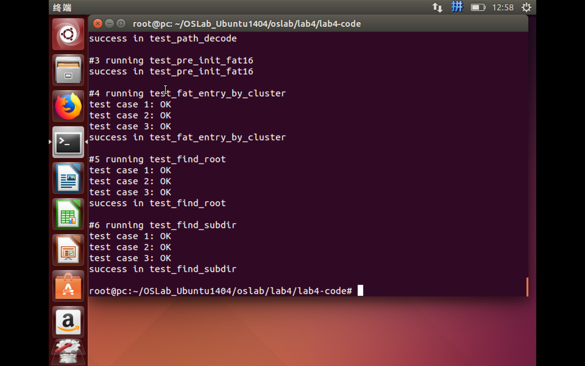
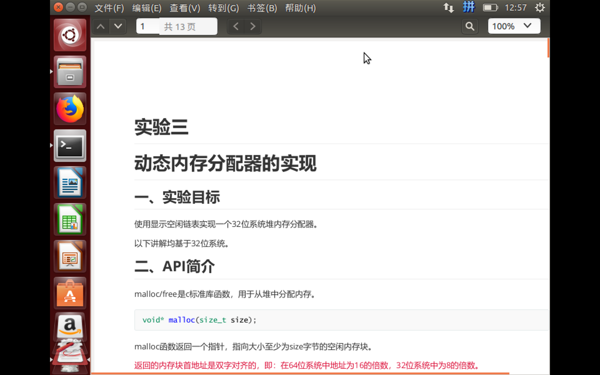

# 4-PB17111568-郭雨轩

## 主要内容

本次实验的基础版本是使用libfuse实现一个只读的FAT16文件系统。

## 实验步骤

助教已经给出了一个基础版本的代码，只需要填充9个部分的内容即可实现这个文件系统。因为接口已经事先给好，所以这个实验总的来说还是比较简单的。在搭建好实验环境后，按照需求编写代码就可以完成实验（而且debug的体验比lab3好很多）。

## 核心代码解析

1. `path_split()`：

   ``` c
   char **path_split(char *pathInput, int *pathDepth_ret)
   {
     int i,j;
     int pathDepth = 0;
     for (i=0;pathInput[i]!='\0';++i)
     {
       if (pathInput[i]=='/')
       {
         pathDepth++;
       }
     }
     char **paths = (char **)malloc(pathDepth * sizeof(char *));
     for (i=0,j=1;i<pathDepth;++i)
     {
       paths[i]=(char *)malloc(12 * sizeof(char));
       int k1=-1;
       int k;
       for (k=j;pathInput[k]!='\0' && pathInput[k]!='/';++k)
       {
         if (pathInput[k]=='.')
         {
           k1=k;
         }
       }//找点号所在的位置，若没有则为-1
       if (k1==-1)
       {
         int l;
         for (l=0;l<12;++l)
         {
           if (l<8)
           {
             if (j<k)
             {
               paths[i][l]=upper(pathInput[j]);
               ++j;
             }
             else 
               paths[i][l]=' ';
           }
           else if (l>=8 && l<11)
           {
             paths[i][l]=' ';
           }
           else
           {
             paths[i][l]='\0';
           }
         }
       }
       else
       {
         int l;
         for (l=0;l<12;++l) 
         {
           if (l<8)
           {
             if (j<k1)
             {
               paths[i][l]=upper(pathInput[j]);
               ++j;
             }
             else 
               paths[i][l]=' ';
           }
           else if (l==8)
           {
             j=k1+1;
             if (j<k)
             {
               paths[i][l]=upper(pathInput[j]);
               j++;
             }
             else 
               paths[i][l]=' ';
           }
           else if (l>8 && l<11)
           {
             if (j<k)
             {
               paths[i][l]=upper(pathInput[j]);
               j++;
             }
             else 
               paths[i][l]=' ';
           }
           else 
             paths[i][l]='\0';
         }
       }
       j=k+1;
     }
     *pathDepth_ret=pathDepth;
     return paths;
   }
   ```

   对于我来讲，其实整个实验部分最难的两个代码就是前两个对字符串处理的函数（菜的真实）。要实现对路径的分割，首先需要统计路径中出现的所有的`/`，这个就代表目录的深度。其次，再遍历每个字路径中所有的自负，若名称中存在扩展名，则将名称中点号之后的字符复制到格式化名称的后三位，否则只需要复制前八位即可。如此就可以实现路径分割。

2. `path_decode()`

   ``` c
   BYTE *path_decode(BYTE *path)
   {
   
     BYTE *pathDecoded = malloc(MAX_SHORT_NAME_LEN * sizeof(BYTE));
     int i,j;
     for (i=0;i<8;++i)
     {
       if (path[i]!=' ')
       {
         pathDecoded[i]=lower((char)path[i]);
       }
       else 
         break;
     }
     if (path[8]==' ')//无扩展名
     {
       pathDecoded[i]='\0';
     }
     else {
       pathDecoded[i]='.';
       ++i;
       for (j=8;j<11;++j)
       {
         if (path[j]!=' ')
         {
           pathDecoded[i]=lower((char)path[j]);
           ++i;
         }
       }
       pathDecoded[i]='\0';
     }
     return pathDecoded;
   }
   ```

   将路径解码的过程要相对简单的多，因为编码是是规范的，所以只需要将编码名称多前八位进行复制，再根据是否有扩展名来确定扩展名部分的内容是否需要复制即可。

3. `pre_init_fat16()`

   ``` c
   FAT16 *pre_init_fat16(void)
   {
     /* Opening the FAT16 image file */
     FILE *fd;
     FAT16 *fat16_ins;
   
     fd = fopen(FAT_FILE_NAME, "rb");
   
     if (fd == NULL)
     {
       fprintf(stderr, "Missing FAT16 image file!\n");
       exit(EXIT_FAILURE);
     }
   
     fat16_ins = malloc(sizeof(FAT16));
     fat16_ins->fd = fd;
   
     /** TODO: 
      * 初始化fat16_ins的其余成员变量
      * Hint: root directory的大小与Bpb.BPB_RootEntCnt有关，并且是扇区对齐的
     **/
     char buffer[BYTES_PER_SECTOR];
     sector_read(fd, 0, (void *)buffer);
     int i;
     for (i=0;i<3;++i){
       fat16_ins->Bpb.BS_jmpBoot[i]=buffer[i];
     }
     for (i=0;i<8;++i){
       fat16_ins->Bpb.BS_OEMName[i]=buffer[0x3+i];
     }
     fat16_ins->Bpb.BPB_BytsPerSec = *((WORD *)(&buffer[0xb]));
     fat16_ins->Bpb.BPB_SecPerClus = buffer[0xd];
     fat16_ins->Bpb.BPB_RsvdSecCnt = *((WORD *)(&buffer[0xe]));
     fat16_ins->Bpb.BPB_NumFATS = buffer[0x10];
     fat16_ins->Bpb.BPB_RootEntCnt = *((WORD *)(&buffer[0x11]));
     fat16_ins->Bpb.BPB_TotSec16 = *((WORD *)(&buffer[0x13]));
     fat16_ins->Bpb.BPB_Media = buffer[0x15];
     fat16_ins->Bpb.BPB_FATSz16 = *((WORD *)(&buffer[0x16]));
     fat16_ins->Bpb.BPB_SecPerTrk = *((WORD *)(&buffer[0x18]));
     fat16_ins->Bpb.BPB_NumHeads = *((WORD *)(&buffer[0x1a]));
     fat16_ins->Bpb.BPB_HiddSec = *((DWORD *)(&buffer[0x1c]));
     fat16_ins->Bpb.BPB_TotSec32 = *((DWORD *)(&buffer[0x20]));
     fat16_ins->Bpb.BS_DrvNum = buffer[0x24];
     fat16_ins->Bpb.BS_Reserved1 = buffer[0x25];
     fat16_ins->Bpb.BS_BootSig = buffer[0x26];
     fat16_ins->Bpb.BS_VollID = *((DWORD *)(&buffer[0x27]));
     for (i=0;i<11;++i){
       fat16_ins->Bpb.BS_VollLab[i] = buffer[0x2b+i];
     }
     for (i=0;i<8;++i){
       fat16_ins->Bpb.BS_FilSysType[i] = buffer[0x36+i];
     }
     for (i=0;i<448;++i){
       fat16_ins->Bpb.Reserved2[i] = buffer[i+0x3e];
     }
     fat16_ins->Bpb.Signature_word = *((WORD *)(&buffer[0x1fe]));
   
     fat16_ins->FirstRootDirSecNum = fat16_ins->Bpb.BPB_RsvdSecCnt+(fat16_ins->Bpb.BPB_NumFATS)*(fat16_ins->Bpb.BPB_FATSz16);
     fat16_ins->FirstDataSector = fat16_ins->FirstRootDirSecNum+32*(fat16_ins->Bpb.BPB_RootEntCnt)/(fat16_ins->Bpb.BPB_BytsPerSec);
     
     return fat16_ins;
   }
   ```

   这部分的内容同样十分简单。在我一开始编写的时候，我不是很清楚结构体中每个变量代表的内容，但是对照首个扇区的内容后我发现，结构体声明的顺序与首个扇区的里面填充的内容顺序相同，只需要将第一个扇区中的抄到结构体中即可。

4. `fat_entry_by_cluster()`

   ``` c
   WORD fat_entry_by_cluster(FAT16 *fat16_ins, WORD ClusterN)
   {
     BYTE sector_buffer[BYTES_PER_SECTOR];
     DWORD Fat1_Start = fat16_ins->Bpb.BPB_RsvdSecCnt;
     WORD Fat1_Large = fat16_ins->Bpb.BPB_FATSz16;//可以在检查是否越界的时候使用，以增加安全性
     WORD Sec_Large = fat16_ins->Bpb.BPB_BytsPerSec;
   
     //需要寻找对应的扇区来找到对应簇的后继，首先要确定ClusterN簇号存储在哪一个扇区，再确定偏移了多少；
     //因为使用两个字节来存储一个簇的簇号所以...
     int Sec_Shift = (ClusterN*2)/Sec_Large;
     int Byte_Shift = (ClusterN*2)%Sec_Large;
     sector_read(fat16_ins->fd, (Fat1_Start+Sec_Shift), sector_buffer);
     WORD result = *((WORD *)(&sector_buffer[Byte_Shift]));
   
   
     return result;
   }
   ```

   FAT表中每个项占两个字节，所以要想知道簇N对应的下一个块，就需要先根据要查找的簇号算出扇区的偏移，读取对应扇区的内容，再算出扇区内字节的偏移，就得到了要查找的簇号和后继。

5. `find_root()`

   ``` c
   for (i = 0; i < fat16_ins->Bpb.BPB_RootEntCnt; i++)
     {
       //先判断是否超出当前扇区；
       if (i*32 >= (RootDirCnt+1)*BYTES_PER_SECTOR){
         RootDirCnt++;
         sector_read(fat16_ins->fd, (fat16_ins->FirstRootDirSecNum)+RootDirCnt, buffer);
       }
       char Name_Buffer[12];
       int Start_Read=(i*32)%BYTES_PER_SECTOR;
       for (j=0;j<11;++j){
         Name_Buffer[j] = buffer[Start_Read+j];
       }
       Name_Buffer[12]='\0';
       if (strncmp(Name_Buffer, paths[0],11)==0){
         for (j=0;j<11;++j){
           Dir->DIR_Name[j] = Name_Buffer[j];
         }
         Dir->DIR_Attr = buffer[Start_Read+0x0b];
         Dir->DIR_NTRes = buffer[Start_Read+0x0c];
         Dir->DIR_CrtTimeTenth = buffer[Start_Read+0x0d];
         Dir->DIR_CrtTime = *((WORD *)(&buffer[Start_Read+0x0e]));
         Dir->DIR_CrtDate = *((WORD *)(&buffer[Start_Read+0x10]));
         Dir->DIR_LstAccDate = *((WORD *)(&buffer[Start_Read+0x12]));
         Dir->DIR_FstClusHI = *((WORD *)(&buffer[Start_Read+0x14]));
         Dir->DIR_WrtTime = *((WORD *)(&buffer[Start_Read+0x16]));
         Dir->DIR_WrtDate = *((WORD *)(&buffer[Start_Read+0x18]));
         Dir->DIR_FstClusLO = *((WORD *)(&buffer[Start_Read+0x1a]));
         Dir->DIR_FileSize = *((DWORD *)(&buffer[Start_Read+0x1c]));
         if (pathDepth==1){
           return 0;
         }
         else{
           return find_subdir(fat16_ins, Dir, paths, pathDepth, 1);
         }
       }
     }
   ```

   这个函数的核心代码如上。扇区的根目录中每项有32个byte，共有512项，所以只要按照每个项查找匹配的名称，查找到后，再根据提供的目录的深度来判断是否需要调用寻找子目录查找的函数，如果不需要就直接返回文件的信息，需要的话就进行下一步查找。

6. `find_subdir`

   ``` c
   int find_subdir(FAT16 *fat16_ins, DIR_ENTRY *Dir, char **paths, int pathDepth, int curDepth)
   {
     BYTE buffer[BYTES_PER_SECTOR];
     if (curDepth<pathDepth){
       int i, j, k;//i簇内扇区偏移，j为扇区内字节偏移
       WORD ClusterN = Dir->DIR_FstClusLO; 
       WORD FatClusEntryVal, FirstSectorofCluster;
       //第一个变量是当前簇的后继簇号，第二个是该簇的第一个扇区号。
       first_sector_by_cluster(fat16_ins,ClusterN,&FatClusEntryVal,&FirstSectorofCluster,buffer);
       //开始进行查找
       while (ClusterN >= 0x0002 && ClusterN <= 0xffef){
         first_sector_by_cluster(fat16_ins,ClusterN,&FatClusEntryVal,&FirstSectorofCluster,buffer);
         for (i=0;i<fat16_ins->Bpb.BPB_SecPerClus;++i){
           sector_read(fat16_ins->fd, FirstSectorofCluster+i, buffer);
           for (j=0;j<BYTES_PER_SECTOR;j+=32){
             char Name_Buffer[12];
             for (k=0;k<11;++k){
               Name_Buffer[k] = buffer[j+k];
             }
             Name_Buffer[12]='\0';
             if (strncmp(Name_Buffer, paths[curDepth],11)==0){
               for (k=0;k<11;++k){
                 Dir->DIR_Name[k] = Name_Buffer[k];
               }
               int Start_Read=j;
               Dir->DIR_Attr = buffer[Start_Read+0x0b];
               Dir->DIR_NTRes = buffer[Start_Read+0x0c];
               Dir->DIR_CrtTimeTenth = buffer[Start_Read+0x0d];
               Dir->DIR_CrtTime = *((WORD *)(&buffer[Start_Read+0x0e]));
               Dir->DIR_CrtDate = *((WORD *)(&buffer[Start_Read+0x10]));
               Dir->DIR_LstAccDate = *((WORD *)(&buffer[Start_Read+0x12]));
               Dir->DIR_FstClusHI = *((WORD *)(&buffer[Start_Read+0x14]));
               Dir->DIR_WrtTime = *((WORD *)(&buffer[Start_Read+0x16]));
               Dir->DIR_WrtDate = *((WORD *)(&buffer[Start_Read+0x18]));
               Dir->DIR_FstClusLO = *((WORD *)(&buffer[Start_Read+0x1a]));
               Dir->DIR_FileSize = *((DWORD *)(&buffer[Start_Read+0x1c]));
               return find_subdir(fat16_ins, Dir, paths, pathDepth, curDepth+1);
             }
             if (Name_Buffer[0]==0 && Name_Buffer[1]==0){
               return 1;
             }
           }
         }
         ClusterN = FatClusEntryVal;
         
       }
     }
     else if (curDepth == pathDepth){
       return 0;
     }
     return 1;
   }
   ```

   这个函数也是实现中比较简单的一个函数。其思路是按照目录的深度进行递归查找，只需通过判断当前查找的目录深度来判断是否需要进行下一步递归或者返回值。需要注意的是，这个与find_root不是很相同，原因在于。对于findroot函数，其文件中存储的内容在物理上是连续的，所以只需要按照顺序检查每个扇区内是否有符合要求的文件名。但是对于寻找子目录这个函数，由于子目录没有特定的大小限制，所以是有可能跨簇寻找匹配项的，所以还需要考虑到是否读取到文件结束，最后的代码如上。

7. `fat16_readdir()`

   ```c
   int fat16_readdir(const char *path, void *buffer, fuse_fill_dir_t filler,
                     off_t offset, struct fuse_file_info *fi)
   {
     FAT16 *fat16_ins;
     BYTE sector_buffer[BYTES_PER_SECTOR];
   
     struct fuse_context *context;
     context = fuse_get_context();
     fat16_ins = (FAT16 *)context->private_data;
   
     sector_read(fat16_ins->fd, fat16_ins->FirstRootDirSecNum, sector_buffer);
   
     if (strcmp(path, "/") == 0)
     {
       DIR_ENTRY Root;
       int i,j;
       int RootDirCnt = 0;
   
       /** TODO:
        * 将root directory下的文件或目录通过filler填充到buffer中
        * 注意不需要遍历子目录
       **/
   
       for (i = 0; i < fat16_ins->Bpb.BPB_RootEntCnt; i++)
       {
         if (i*32 >= (RootDirCnt+1)*BYTES_PER_SECTOR){
           RootDirCnt++;
           sector_read(fat16_ins->fd, (fat16_ins->FirstRootDirSecNum)+RootDirCnt, sector_buffer);
         }
         BYTE Name_Buffer[12];
         int Start_Read=(i*32)%BYTES_PER_SECTOR;
         for (j=0;j<11;++j){
           Name_Buffer[j] = sector_buffer[Start_Read+j];
         }
         Name_Buffer[12]='\0';
         if ((BYTE)Name_Buffer[0]==0 && (BYTE)Name_Buffer[1]==0){
           break;
         }//根目录遍历结束
   
         
         for (j=0;j<11;++j){
           Root.DIR_Name[j] = Name_Buffer[j];
         }
         Root.DIR_Attr = sector_buffer[Start_Read+0x0b];
         Root.DIR_NTRes = sector_buffer[Start_Read+0x0c];
         Root.DIR_CrtTimeTenth = sector_buffer[Start_Read+0x0d];
         Root.DIR_CrtTime = *((WORD *)(&sector_buffer[Start_Read+0x0e]));
         Root.DIR_CrtDate = *((WORD *)(&sector_buffer[Start_Read+0x10]));
         Root.DIR_LstAccDate = *((WORD *)(&sector_buffer[Start_Read+0x12]));
         Root.DIR_FstClusHI = *((WORD *)(&sector_buffer[Start_Read+0x14]));
         Root.DIR_WrtTime = *((WORD *)(&sector_buffer[Start_Read+0x16]));
         Root.DIR_WrtDate = *((WORD *)(&sector_buffer[Start_Read+0x18]));
         Root.DIR_FstClusLO = *((WORD *)(&sector_buffer[Start_Read+0x1a]));
         Root.DIR_FileSize = *((DWORD *)(&sector_buffer[Start_Read+0x1c]));
         
         if ((BYTE)Name_Buffer[0]==0x00 || (BYTE)Name_Buffer[0]==0xe5 || (BYTE)Root.DIR_Attr==0x0f){
           continue;
         }
         //printf("%x\n", Name_Buffer[0]);
         const char *filename = (const char *)path_decode(Root.DIR_Name);
         filler(buffer, filename, NULL, 0);
         /**
          * const char *filename = (const char *)path_decode(Root.DIR_Name);
          * filler(buffer, filename, NULL, 0);
         **/
   
       }
     }
     else
     {
       DIR_ENTRY Dir;
       int i,j,k;
       WORD ClusterN, FatClusEntryVal, FirstSectorofCluster;
   
       /** TODO:
        * 通过find_root获取path对应的目录的目录项，
        * 然后访问该目录，将其下的文件或目录通过filler填充到buffer中，
        * 同样注意不需要遍历子目录
        * Hint: 需要考虑目录大小，可能跨扇区，跨簇
       **/
       find_root(fat16_ins, &Dir, path);
       ClusterN = Dir.DIR_FstClusLO;
       first_sector_by_cluster(fat16_ins,ClusterN,&FatClusEntryVal,&FirstSectorofCluster,sector_buffer);
       int end_flag=0;
   
       while (ClusterN >= 0x0002 && ClusterN <= 0xffef){
         first_sector_by_cluster(fat16_ins,ClusterN,&FatClusEntryVal,&FirstSectorofCluster,sector_buffer);
         for (i=0;i<fat16_ins->Bpb.BPB_SecPerClus;++i){
           sector_read(fat16_ins->fd,FirstSectorofCluster+i,sector_buffer);
           for (j=0;j<BYTES_PER_SECTOR;j+=32){
             char Name_Buffer[12];
             for (k=0;k<11;++k){
               Name_Buffer[k] = sector_buffer[j+k];
             }
             Name_Buffer[12]='\0';
             if ((BYTE)Name_Buffer[0]==0 && (BYTE)Name_Buffer[1]==0){
               end_flag=1;
               break;
             }//当前目录遍历结束
             for (k=0;k<11;++k){
                 Dir.DIR_Name[k] = Name_Buffer[k];
             }
             int Start_Read=j;
             Dir.DIR_Attr = sector_buffer[Start_Read+0x0b];
             Dir.DIR_NTRes = sector_buffer[Start_Read+0x0c];
             Dir.DIR_CrtTimeTenth = sector_buffer[Start_Read+0x0d];
             Dir.DIR_CrtTime = *((WORD *)(&sector_buffer[Start_Read+0x0e]));
             Dir.DIR_CrtDate = *((WORD *)(&sector_buffer[Start_Read+0x10]));
             Dir.DIR_LstAccDate = *((WORD *)(&sector_buffer[Start_Read+0x12]));
             Dir.DIR_FstClusHI = *((WORD *)(&sector_buffer[Start_Read+0x14]));
             Dir.DIR_WrtTime = *((WORD *)(&sector_buffer[Start_Read+0x16]));
             Dir.DIR_WrtDate = *((WORD *)(&sector_buffer[Start_Read+0x18]));
             Dir.DIR_FstClusLO = *((WORD *)(&sector_buffer[Start_Read+0x1a]));
             Dir.DIR_FileSize = *((DWORD *)(&sector_buffer[Start_Read+0x1c]));
             
             if ((BYTE)Name_Buffer[0]==0x00 || (BYTE)Name_Buffer[0]==0xe5 || (BYTE)Dir.DIR_Attr==0x0f){
               continue;
             }
             const char *filename = (const char *)path_decode(Dir.DIR_Name);
             filler(buffer, filename, NULL, 0);
           }
           if (end_flag==1){
             break;
           }
         }
         if (end_flag==1){
           break;
         }
         ClusterN = FatClusEntryVal;
       }
     }
     return 0;
   }
   ```

   这个函数的实现更是非常简单，两个部分中所有的逻辑与`find_root`和`find_subdir`完全一致，只不过是把查找特定的文件或者目录改成将所有的文件和目录的名字录入。但是，也不是完全相同的，因为助教给出的镜像中是包括长文件名的镜像，所以就需要判断当前在读的项是LFN项还是文件项。在上课的时候讲到，LFN的文件属性是特定的`0x0F`所以可以根据这个来识别是否是LFN。同样还需要判断这个文件是不是被删除了，所以需要判断文件名的第一个字符，判断是不是无效。

8. `fat16_read()`

   ``` c
   int fat16_read(const char *path, char *buffer, size_t size, off_t offset,
                  struct fuse_file_info *fi)
   {
     FAT16 *fat16_ins;
     struct fuse_context *context;
     context = fuse_get_context();
     fat16_ins = (FAT16 *)context->private_data;
     DIR_ENTRY File;
     BYTE sector_buffer[BYTES_PER_SECTOR];
     WORD ClusterN, FatClusEntryVal, FirstSectorofCluster;
     find_root(fat16_ins, &File, path);
     ClusterN = File.DIR_FstClusLO;
     DWORD File_Size = File.DIR_FileSize;
     if ((DWORD)offset >= File_Size){
       return 0;
     }
     first_sector_by_cluster(fat16_ins,ClusterN,&FatClusEntryVal,&FirstSectorofCluster,sector_buffer);
     int i;
     int Cluster_Shift = (offset)/((fat16_ins->Bpb.BPB_SecPerClus)*(fat16_ins->Bpb.BPB_BytsPerSec));
     for (i=0;i<Cluster_Shift;++i){
       ClusterN = FatClusEntryVal;
       first_sector_by_cluster(fat16_ins,ClusterN,&FatClusEntryVal,&FirstSectorofCluster,sector_buffer);
     }
   
     DWORD Real_Read_Size = ((DWORD)offset+(DWORD)size)<=File_Size ? (DWORD)size : (DWORD)File_Size-(DWORD)offset;
     DWORD Start_Sector = (offset - Cluster_Shift*(fat16_ins->Bpb.BPB_SecPerClus)*(fat16_ins->Bpb.BPB_BytsPerSec))/fat16_ins->Bpb.BPB_BytsPerSec;
     DWORD Start_Byte = offset - Cluster_Shift*(fat16_ins->Bpb.BPB_SecPerClus)*(fat16_ins->Bpb.BPB_BytsPerSec) - Start_Sector*(fat16_ins->Bpb.BPB_BytsPerSec);
     
     
     int CurSector = FirstSectorofCluster + Start_Sector;
     sector_read(fat16_ins->fd, CurSector, sector_buffer);
   
   
     for (i=0;i<Real_Read_Size;++i,++Start_Byte){
       if ((Start_Byte) >= BYTES_PER_SECTOR){
         Start_Byte = 0;
         if (CurSector+1-FirstSectorofCluster>=fat16_ins->Bpb.BPB_SecPerClus){
           ClusterN = FatClusEntryVal;
           first_sector_by_cluster(fat16_ins,ClusterN,&FatClusEntryVal,&FirstSectorofCluster,sector_buffer);
           CurSector = FirstSectorofCluster;
         }
         else {
           CurSector++;
           sector_read(fat16_ins->fd, CurSector, sector_buffer);
         }
       }
       buffer[i] = sector_buffer[Start_Byte];
     }
     return (int)Real_Read_Size;
   }
   ```

   这个函数实现的细节在于首先需要根据offset算出要读的位置的簇号、簇内扇区的偏移和扇区内字节偏移。然后将这个之后的real_size内容复制到buffer中。

## 实验截图

1. 实验测试截图

   

2. 读取pdf截图

   

## 实验要点

本次实验的基础部分说句实话不是很难，只需要时刻注意当前读取的数据到底是在哪个簇、哪个扇区，哪个字节即可，当读取的指针变动的时候，也要同时进行这些的更新，才能保证不会出错。

## 实验总结

- 通过这次实验，我对FAT这一类的文件系统有了更深刻的了解，对其基本的结构和实现有了更加深刻的认识。
- 发现了多线程对于实验结果的干扰，帮助助教找出了实验指导书中的一个错误。